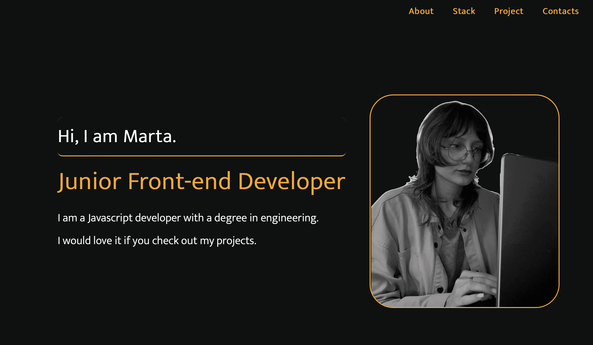

Demo: https://godoxyfair.github.io/portfolio-card/

## Портфолио проект
## Фреймворк React JS

Так же использованы react-router-dom, hooks
Сайт адаптирован для мобильных устройств и ноутбуков

В процессе работы над проектом, были изучены основные принципы работы с фрейворком




## Project setup
```
npx create-react-app . 
```

### Compiles and hot-reloads for development
```
npm start
```

### Compiles and minifies for production
```
npm run build
```

### Lints and fixes files
```
npm run lint
```


